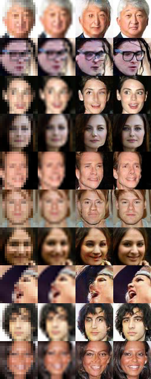

Improved Training of Wasserstein GANs
=====================================
This is a project test Wasserstein GAN objectives on single image super-resolution. The code is built on a fork of [the popular project under the same title](https://github.com/igul222/improved_wgan_training). 

We expand the original repo by another model
`gan_SR.py`: GANs that generate 64x64-pixel images in 16x16 low resolution inputs. The default dataset is the cropped aligned celebA dataset. Other dataset would require minor modifications.

Data preprocessing is required before training:
> `bash celebA_preprocess.sh`
will download celebA dataset, crop and resize to 64x64. Note this might take a while. 

To run, modify the path of data directory, summary directory (for tensorboard) and output directory in `run_script.sh`. 

> `bash run_script.sh`

Here is a sample output, using WGAN-GP objective and DCGAN architecture and training for 1 epoch. 

Description of the original repository
======================================
Code for reproducing experiments in ["Improved Training of Wasserstein GANs"](https://arxiv.org/abs/1704.00028).

## Prerequisites

- Python, NumPy, TensorFlow, SciPy, Matplotlib
- A recent NVIDIA GPU

## Models

Configuration for all models is specified in a list of constants at the top of
the file. Two models should work "out of the box":

- `python gan_toy.py`: Toy datasets (8 Gaussians, 25 Gaussians, Swiss Roll). 
- `python gan_mnist.py`: MNIST

For the other models, edit the file to specify the path to the dataset in
`DATA_DIR` before running. Each model's dataset is publicly available; the
download URL is in the file.

- `python gan_64x64.py`: 64x64 architectures (this code trains on ImageNet instead of LSUN bedrooms in the paper)
- `python gan_language.py`: Character-level language model
- `python gan_cifar.py`: CIFAR-10
